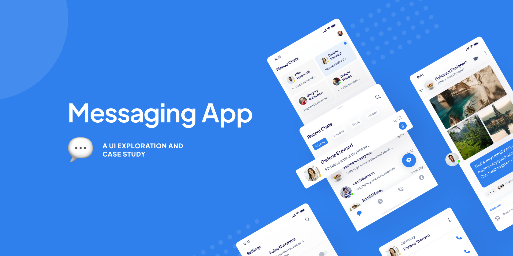

<p align="center">
    
    
    
    
</p>

# Flutter Messaging UI

*Flutter UI Showcase* is a modern and responsive mobile application built using Flutter, designed to demonstrate visually appealing and high-performance user interfaces. This project was created by converting a design from Figma, ensuring precise visual representation and optimized performance. The app highlights a sleek UI with intuitive navigation and smooth transitions, making it a practical reference for developers aiming to create visually stunning applications. This project showcases Flutter's capabilities in building mobile applications that prioritize aesthetics and performance without compromising user experience.

## 🎨 Design

The design of this application is based on the provided Figma file. The slicing process was carried out meticulously to ensure the application accurately represents the design.

## 🚀 Feature

- **Responsive Design**: Supports various screen sizes with responsive UI elements.
- **Dark & Light Theme**: Provides both dark and light modes for a more comfortable user experience.
- **Seamless Navigation**: Implements navigation using Flutter Navigator.
- **Reusable Components**: Modular components for easier development and maintenance.

## 🛠️ Technologies

This project is built using the following technologies:

- **[Flutter](https://flutter.dev/)**: A framework for cross-platform application development.
- **[Dart](https://dart.dev/)**: The primary programming language for Flutter.
- **[Google Fonts](https://fonts.google.com/)**: For custom font integration.
- **[Figma](https://www.figma.com/)**: Used as the application's design reference.

## 📂 Folder Structure

```plaintext
.
├── assets/              # Contains images, icons, and other assets  
├── lib/  
│   ├── config/          # Application configuration (theme, routes, etc.)  
│   ├── screens/         # Main application pages  
│   ├── widgets/         # Reusable UI components  
│   ├── main.dart        # Main application file  
└── pubspec.yaml         # Flutter project configuration  
```

## 🖼️ Screenshot

| Light Mode                                     | Dark Mode                                      |
| ---------------------------------------------- | ---------------------------------------------- |
| 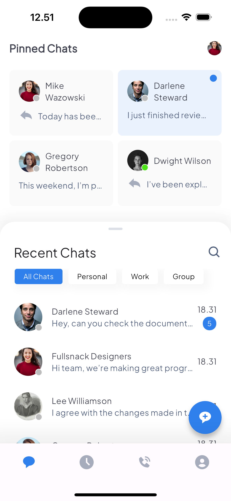 | 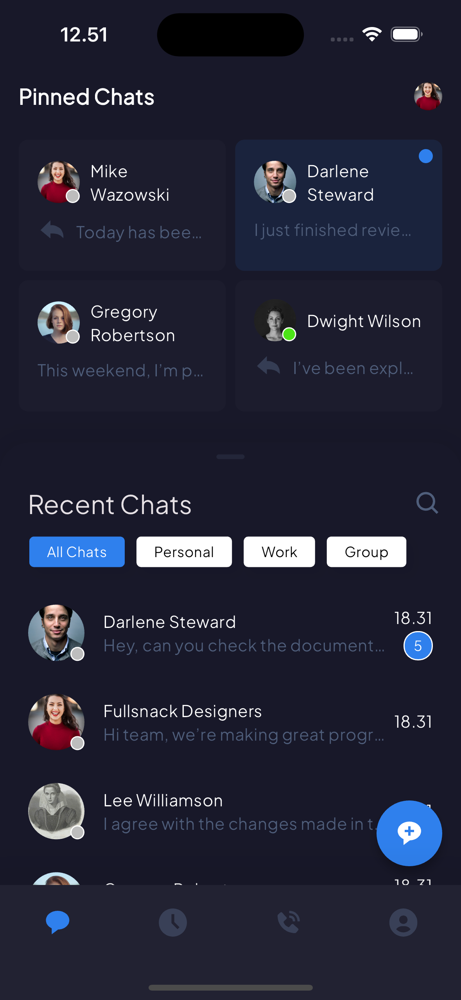 |
| 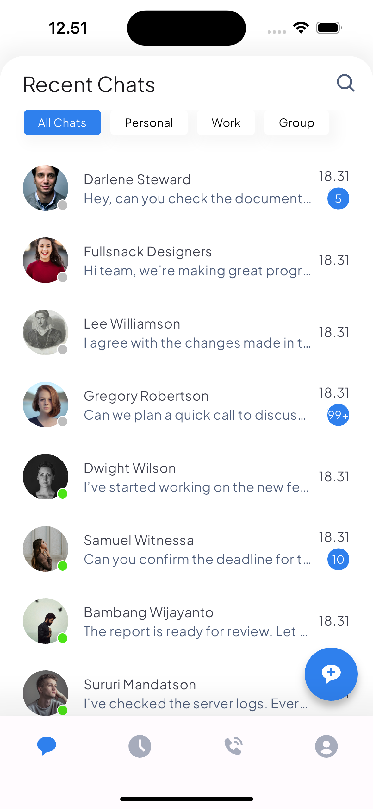 | 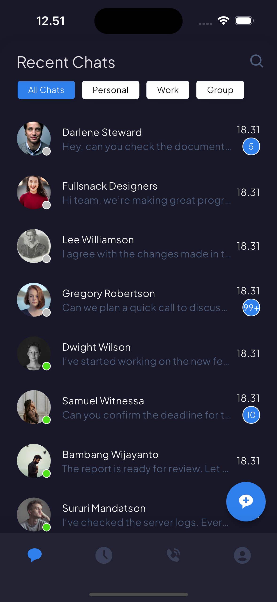 |
| 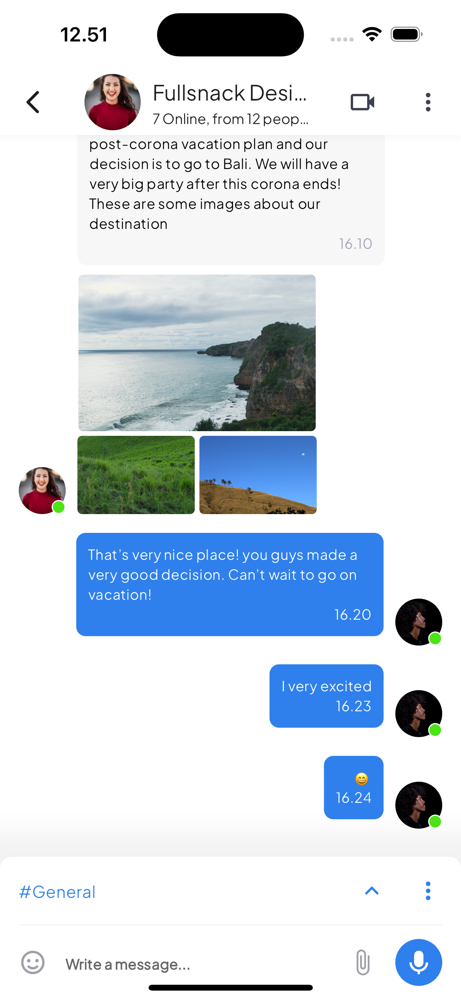 | 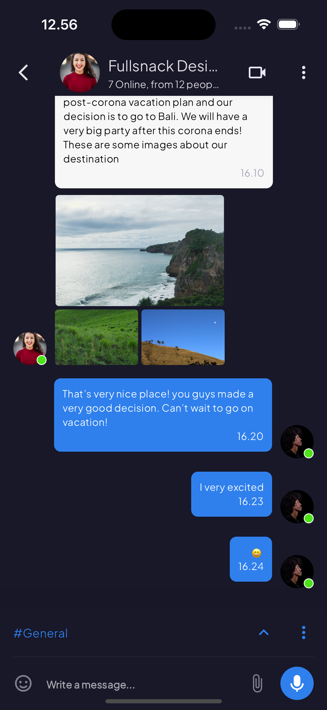 |
| 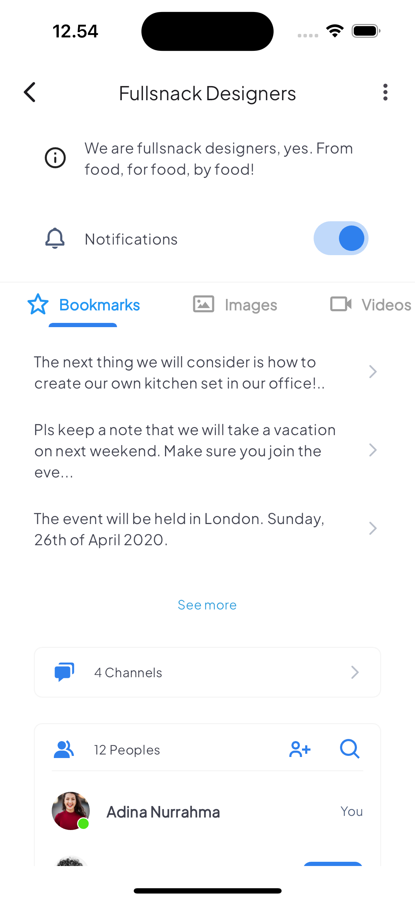 | 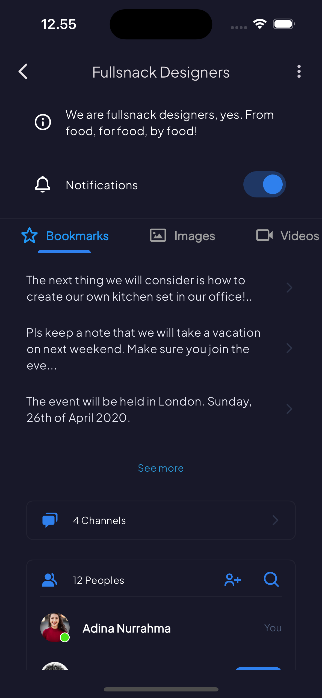 |
| 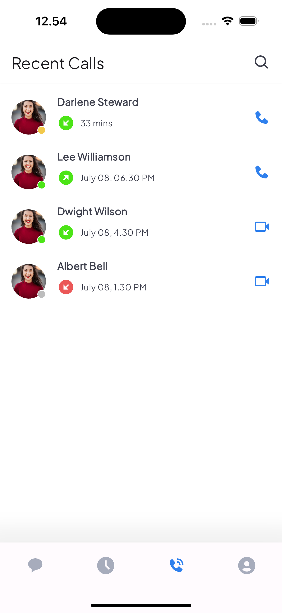 | 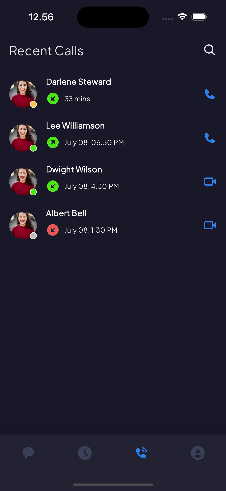 |
| 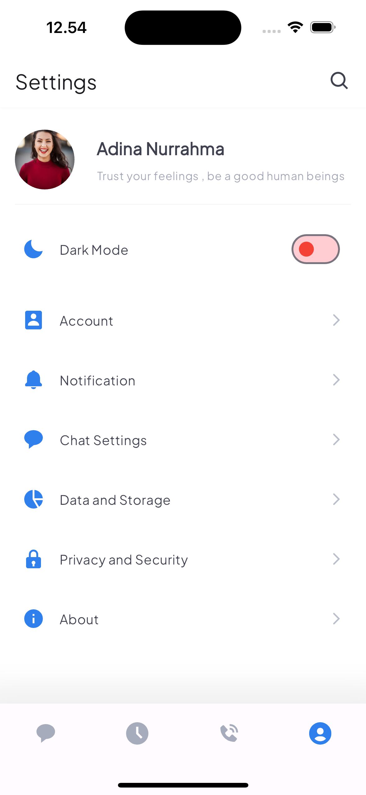 | 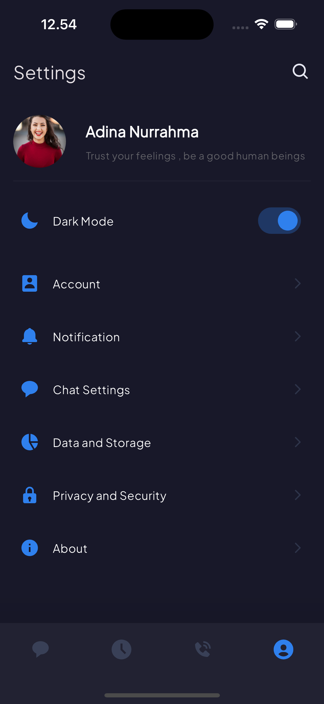 |

## License

This project is licensed under the Creative Commons Attribution-NonCommercial 4.0 International (CC BY-NC 4.0).
You are free to use this project for personal or educational purposes, but commercial use is not allowed.

For more details, refer to the [full license text](LICENSE).

## Disclaimer

The design of this application is based on a free Figma template available on the Figma Community. All rights to the original design belong to the respective creator. This implementation is for learning and non-commercial purposes only.

This project is based on a design from the Figma Community. The design's licensing terms may apply. Please check the original Figma design [here](https://www.figma.com/community/file/881015895655545375). Ensure compliance with the design's terms before using this project.
